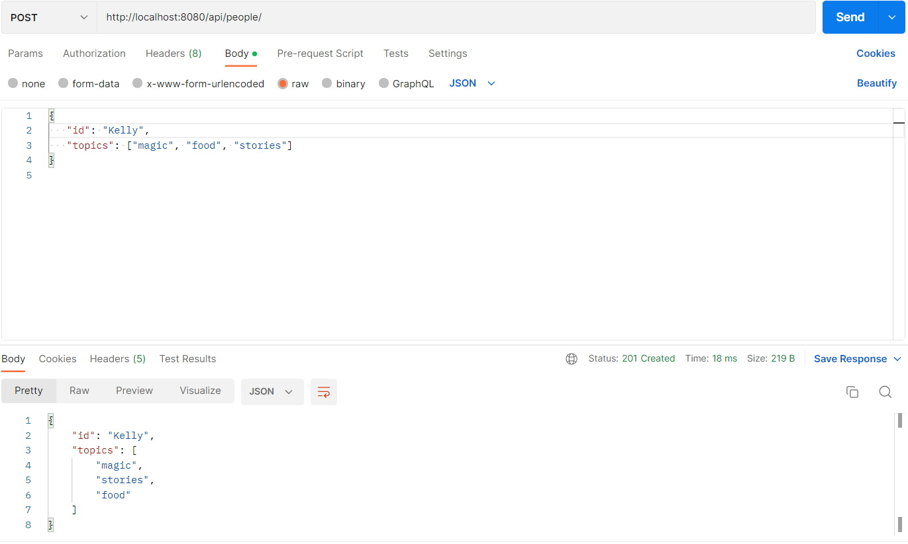

<h1 align="center">TRUSTED NETWORK REST API</h1>

    <h3>Overview</h3>
    
This api suggests sending messages and CRUD pattern endpoints to user.

    
To start and try the api you just need to Start this Spring project on your IDE. The trusted network rest api has been created as a task during participation in DevChallenge XII contest at the online stage

    <h3>Content list</h3>
    <ul>
        <li>
Overview
</li>
        <li>
Technologies used
</li>
        <li>
Database structure
</li>
        <li>
Endpoints description
</li>
        <li>
Postman demonstration
</li>
        <li>
Swagger
</li>
        <li>
Work principles description
</li>
        <li>
Conclusion
</li>
    </ul>
    

    <h3>Technologies used</h3>
    

    <ul>
        <li>
Spring boot framework (as a base of this project)
</li>
        <li>
Mapstruct (DTO - Object - DTO converter for increasing data safety and usability)
</li>
        <li>
PostgreSQL
</li>
        <li>
JUnit
</li>
        <li>
Mockito
</li>
        <li>
Swagger
</li>
    </ul>

    <h3>Files structure</h3>

    <h3>Database structure</h3>
    
As you can see on the image below, 3 tables have been created for this project. 

    

        <h5>The 'persons' table contains Person entities with</h5>
        <ul>
            <li>'id' varchar column (as required in the task)</li>
            <li>'topics' jsonb column: the list of topic names that is followed by this Person</li>
            <li>'connections' jsonb column: the map of pairs (Person id -> Trust level) that is trusted by this Person</li>
        </ul>
    

    

        <h5>The 'messages' table contains Message entities with</h5>
        <ul>
            <li>'id' integer column</li>
            <li>'text' varchar column: the text of the message</li>
            <li>'topics' jsonb column: the list of topic names that this Message is related to</li>
            <li>'from_person_id' varchar column: id of sender</li>
            <li>'min_trust_level' integer column: trust level that is needed to receive this message</li>
            <li>'destinations' jsonb column: list of receivers' (Person) ids</li>
        </ul>
    

    

        <h5>The 'messages_directed' table contains MessageDirected entities with</h5>
        <ul>
            <li>'id' integer column</li>
            <li>'text' varchar column: the text of the message</li>
            <li>'topics' jsonb column: the list of topic names that this Message is related to</li>
            <li>'from_person_id' varchar column: id of sender</li>
            <li>'min_trust_level' integer column: trust level that is needed to receive this message</li>
            <li>'path' jsonb column: LinkedList of receivers' (Person) ids that participated in trust delivery of the message</li>
        </ul>
    

    

 
    <h3>Endpoints description</h3>
    
The localhost is used with port 8080

    <h5>There are the following endpoints: </h5>
    <ul>
        <li>
            
/api/people/{id}/trust_connections

            
(POST request)

            
For updating/adding new trust connections set in Request Body to requested Person by id parameter

        </li>
        <li>
            
/api/people/{id}/trust_connections

            
(DELETE request)

            
For deleting trust connections set in Request Body from requested Person by id parameter

        </li>
        <li>
            
/api/people

            
(POST request)

            
To add a new Person with id and topics set in Request Body

        </li>
        <li>
            
/api/people{id}

            
(GET request)

            
To get a Person by id parameter

        </li>
        <li>
            
/api/messages

            
(POST request)

            
To send a message with text, topics, from_person_id, min_trust_level 
                parameters set in Request Body to all persons from connections field 
                of sender that have all included topics and have trust level equal or 
                higher than min_trust_level of the message. All receivers will transfer 
                this message further through their connections according to the same 
                conditions and so on and so on (broadcasting)

        </li>
        <li>
            
/api/path

            
(POST request)

            
To send a message with text, topics, from_person_id, min_trust_level 
                parameters set in Request Body to one the nearest to sender person  
                with appropriate topics. Intermediary persons in chain can not have 
                topic condition as true but should have trust level equal or higher

            than min_trust_level.
        </li>
        <li>
            
/api/trusted/messages

            
(POST request)

            
To send a message with text, topics, from_person_id, min_trust_level 
                parameters set in Request Body to all persons from connections field 
                of sender that have trust level equal or higher than min_trust_level
                of the message.
            

        </li>
    </ul>

    <h3>Postman demonstration</h3>
    

        <h5>The current structure of the connections and persons in database:</h5>
        
    

    

        <h5>POST request to /api/people/{id}/trust_connections</h5>
        
    

    

        <h5>POST request to /api/people</h5>
        
    

    

        <h5>GET request to /api/people</h5>
        
    

    

        <h5>POST request to /api/messages</h5>
        
    

    

        <h5>POST request to /api/path</h5>
        
    

    

        <h5>POST request to /api/trusted/messages</h5>
        
    

    

    <h3>Swagger</h3>
    
After you run this application in you IDE, the swagger will be available by the address: 

    

    <h3>Work principles description</h3>
    
The create, read, update, delete methods are the standard CRUD methods from JPA Repository that are implemented in Service classes

    
Endpoint "api/messages" calls for broadcasting() method that is implemented in MessageServiceBean class. 
        This method calls another recursive method and returns the final value from the recursion. 
        The recursive method is broadcastToChainOfPeople() method that defines the Persons connections and check them for 
        message requirements. In case of fulfillment, sends message to the allowed Person objects (saves message in database)
        and step into recursion but with new Person object as a sender. This new Person object is a receiver of previous message. 
        The chain of calls will be stopped when there are no "unchecked" Person objects or when Person as a sender will
        not have connections that are allowed to receive the message according to topics and trust level condition.

    
Endpoint "api/path" calls for directBroadcasting() method that is implemented in MessageServiceBean class. 
        This method calls another method findTheShortestPathInGraph() to find the shortest path to Person with topics included 
        all the specified in message. After receiving the shortest path, the method creates the response map body with "from" and
        "path" keys. 
        findTheShortestPathInGraph() method that defines the shortest path to the Person in the network that have topic as in message. 
        However, this person should be found according to the trust level condition. This means that if sender has people with trust levels
        more or equals to the minimum in message, the message can use this connection in chain of sending. In other words, 
        even if a person who is trust have no all required topics, it can be used to pass the message further in network 
        among this person's trusted connections. 
        After the sender sends the message, the network is reviewed as a Graph object. To find the shortest path, method starts 
        go through the levels of this Graph, one by one, and when the Person with appropriate topics found, the path from sender
        to this winner person is saved and displayed.

    
Endpoint "api/trusted/messages" calls for broadcastToTrusted() method that is implemented in MessageServiceBean class that finds all the 
        connections of the current Person that are fulfill requirements of the topic (has included in message object topics)
        and has trusted level more or equals to the minimum specified in the message field. 

    <h3>Conclusion</h3>
    

    
As a conclusion I would like to assume that I managed to complete this task using some part of "functional" programming and I'm sure that 
        the methods could be refactored even more and simplified. However, the task is really liked and interesting and I suppose, 
        useful in social media development. 

